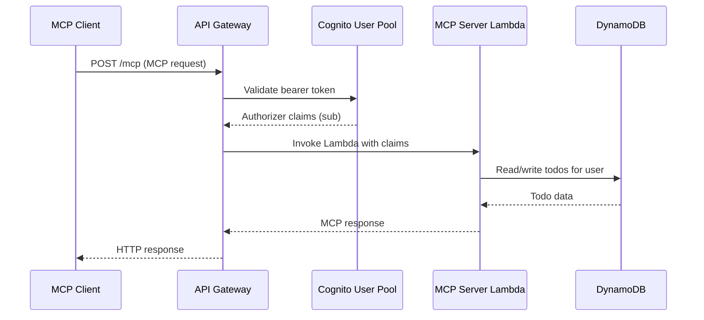

# Todo MCP Server

A remote [Model Context Protocol (MCP)](https://modelcontextprotocol.io/) server for personal todo management, deployed on AWS with API Gateway, Lambda, Cognito, and DynamoDB. Built with the [official MCP TypeScript SDK](https://github.com/modelcontextprotocol/typescript-sdk) and [AWS CDK](https://aws.amazon.com/cdk/).

## Architecture

An MCP client connects to the API Gateway MCP endpoint, which routes requests to a Lambda-hosted MCP server. The server resolves user identity from Cognito authorizer claims and reads/writes that user’s todo items in DynamoDB.



## Repository layout

This project is a [pnpm](https://pnpm.io/) workspace with [Turborepo](https://turborepo.dev/) for task orchestration.

```text
├── apps
│   ├── infra         # AWS CDK application
│   └── server        # MCP server runtime and Lambda handler
└── packages
    ├── conventions   # Shared TypeScript/ESLint configurations
    ├── data-access   # DynamoDB repository implementation
    └── models        # Shared schemas and types
```

## Development

### Prerequisites

- Node.js `^24`
- pnpm `10.x`
- AWS credentials (required for deploy and local server access to DynamoDB)

### Getting started

1. Install dependencies, then build the workspace.

   ```bash
   pnpm install
   pnpm run build
   ```

2. Deploy the infrastructure to get a database for local development.

   ```bash
   pnpm run deploy
   ```

   Then create `apps/server/.env` with your deployed DynamoDB table name.

   ```env
   TODOS_TABLE_NAME=<your-deployed-todos-table-name>
   ```

3. For local testing, use either the stdio server or the HTTP server.

   #### Local stdio server

   Configure your MCP client to use the `stdio-server` entrypoint.

   ```json
   {
     "command": "node",
     "args": ["--env-file=.env", "bin/stdio-server.ts"],
     "cwd": "/path/to/todo-mcp/apps/server"
   }
   ```

   #### Local HTTP server

   Run the server and point your MCP client at `http://localhost:8080/mcp`.

   ```bash
   pnpm run dev
   ```

4. After validating your changes, deploy again to update the remote MCP server.

   ```bash
   pnpm run deploy
   ```

   For faster iteration during development, use CDK hotswap.

   ```bash
   pnpm run deploy:hotswap
   ```

## License

Licensed under the [MIT License](https://github.com/typeparameter/todo-mcp/blob/main/LICENSE).
